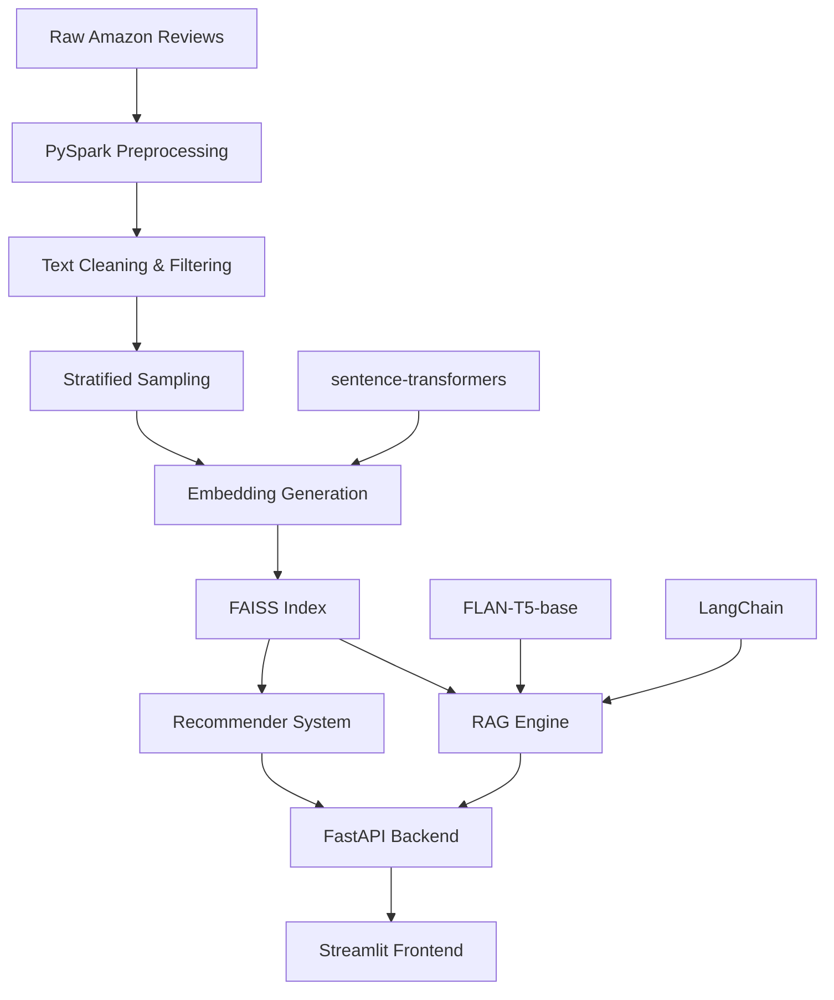

# 🛍️ Amazon Review Intelligence Suite

An end-to-end RAG (Retrieval-Augmented Generation) QA + Recommender system for Amazon product reviews using only free tools.

## 🎯 Overview

This project provides intelligent question answering and product recommendations based on Amazon product reviews. It combines:

- **RAG QA Engine**: Ask questions about product reviews and get AI-generated answers with citations
- **Recommendation System**: Find similar products based on content similarity with rationales
- **Modern UI**: Single Streamlit interface with two tabs for QA and Recommendations
- **Scalable Backend**: FastAPI with efficient vector search using FAISS

## 🏗️ Architecture



## 🚀 Features

### RAG QA Engine
- **Question Answering**: Ask natural language questions about product reviews
- **Source Citations**: Get specific review snippets that support the answer
- **Context-Aware**: Uses relevant reviews to generate accurate responses
- **Configurable**: Adjustable number of sources and input length

### Recommendation System
- **Text Query**: Find products by describing what you're looking for
- **Similar Products**: Find products similar to a given product ID
- **Category Top**: Get top-rated products in specific categories
- **Rationale**: Understand why products are recommended with review snippets

### Data Processing
- **PySpark Pipeline**: Scalable preprocessing with verified-only filtering
- **Stratified Sampling**: Balanced sampling across categories and ratings
- **Text Cleaning**: Comprehensive text preprocessing and normalization
- **Deterministic**: Reproducible results with fixed random seeds

## 📁 Repository Structure

```
amazon_review_intelligence_suite/
├── README.md
├── config.yaml                    # Configuration file
├── requirements.txt               # Python dependencies
├── data/
│   ├── raw/                      # Raw Amazon review data
│   ├── processed/                # Cleaned and processed data
│   └── exports/                  # EDA samples and exports
├── notebooks/
│   ├── 01_EDA.ipynb             # Exploratory Data Analysis
│   └── 06_Evaluation.ipynb      # System Evaluation
├── src/
│   ├── data_loader.py           # Data loading utilities
│   ├── text_preprocess.py       # PySpark preprocessing pipeline
│   ├── embedding.py             # Embedding generation and FAISS
│   ├── rag_engine.py            # RAG QA engine
│   ├── recommender.py           # Product recommendation system
│   └── utils/
│       ├── logger.py            # Logging utilities
│       └── monitoring.py        # Monitoring utilities
├── api/
│   ├── main.py                  # FastAPI application
│   ├── routers/
│   │   ├── ask_review.py        # QA endpoints
│   │   └── recommend.py         # Recommendation endpoints
│   └── schemas/
│       └── input_schema.py      # Pydantic schemas
├── frontend/                    # React frontend for Netlify
│   ├── src/
│   ├── public/
│   ├── package.json
│   └── netlify.toml
├── streamlit_app/
│   └── app.py                   # Streamlit frontend (alternative)
├── infra/
│   ├── Dockerfile               # Multi-stage Docker build
│   └── docker-compose.yml       # Docker Compose configuration
└── tests/                       # Comprehensive test suite
    ├── test_preprocessing.py
    ├── test_rag_engine.py
    ├── test_api.py
    └── conftest.py
```

## 🛠️ Installation

### Prerequisites

- Python 3.9+
- Java 8+ (for PySpark)
- Docker and Docker Compose (optional)

### Local Installation

1. **Clone the repository**
   ```bash
   git clone <repository-url>
   cd amazon-review-intelligence-suite
   ```

2. **Create virtual environment**
   ```bash
   python -m venv venv
   source venv/bin/activate  # On Windows: venv\Scripts\activate
   ```

3. **Install dependencies**
   ```bash
   pip install -r requirements.txt
   ```

4. **Download data** (if not already available)
   ```bash
   # Place your Amazon review parquet files in data/raw/
   # The system expects data in category subdirectories
   ```

## 🚀 Quick Start

### 1. Data Preprocessing

```bash
# Run the preprocessing pipeline
python src/text_preprocess.py --input "data/raw/*/*.parquet"

# This will create:
# - data/processed/reviews_clean.parquet (processed data)
# - data/exports/eda_sample.parquet (EDA sample)
```

### 2. Generate Embeddings

```bash
# Build embeddings and FAISS index
python src/embedding.py --input "data/processed/reviews_clean.parquet"

# This will create:
# - data/embeddings/embeddings.npy
# - data/embeddings/faiss_index.bin
# - data/embeddings/metadata.pkl
```

### 3. Start the Backend

```bash
# Start FastAPI backend
python api/main.py

# API will be available at http://localhost:8000
# API docs at http://localhost:8000/docs
```

### 4. Start the Frontend

**Option A: React Frontend (Netlify-ready)**
```bash
# Navigate to frontend directory
cd frontend

# Install dependencies
npm install

# Start development server
npm start

# UI will be available at http://localhost:3000
```

**Option B: Streamlit Frontend (Alternative)**
```bash
# Start Streamlit frontend
streamlit run streamlit_app/app.py

# UI will be available at http://localhost:8501
```

## 🐳 Docker Deployment

### Using Docker Compose

```bash
# Build and start all services
docker-compose -f infra/docker-compose.yml up --build

# Services will be available at:
# - API: http://localhost:8000
# - Streamlit: http://localhost:8501
```

### Individual Services

```bash
# Build API service
docker build -f infra/Dockerfile --target api -t amazon-rag-api .

# Build Streamlit service
docker build -f infra/Dockerfile --target streamlit -t amazon-rag-ui .

# Run services
docker run -p 8000:8000 amazon-rag-api
docker run -p 8501:8501 amazon-rag-ui
```

## 📊 Configuration

The system is configured via `config.yaml`:

```yaml
preprocess:
  input_glob: "data/raw/*/*.parquet"
  output_parquet: "data/processed/reviews_clean.parquet"
  mode: "stratified_sample"  # single_category | stratified_sample | full
  verified_only: true
  target_rows_total: 100000
  per_category_cap: 25000

embedding:
  model_name: "sentence-transformers/all-MiniLM-L6-v2"
  batch_size: 64
  index_type: "HNSW"

rag:
  top_k: 5
  generator_model: "google/flan-t5-base"

recommend:
  top_k: 10
  min_similarity: 0.3
```

## 🔧 Usage

### API Endpoints

#### Question Answering
```bash
# Ask a question about reviews
curl -X POST "http://localhost:8000/ask_review/ask" \
  -H "Content-Type: application/json" \
  -d '{"question": "What do customers say about product quality?"}'
```

#### Product Recommendations
```bash
# Get recommendations by query
curl -X POST "http://localhost:8000/recommend/products" \
  -H "Content-Type: application/json" \
  -d '{"query": "wireless headphones with good battery life"}'

# Get similar products
curl -X POST "http://localhost:8000/recommend/products" \
  -H "Content-Type: application/json" \
  -d '{"product_id": "B08N5WRWNW"}'

# Get top products by category
curl -X POST "http://localhost:8000/recommend/products" \
  -H "Content-Type: application/json" \
  -d '{"category": "Electronics"}'
```

### Streamlit UI

1. **Ask Reviews Tab**: Enter questions about product reviews
2. **Recommendations Tab**: Find products using text queries, product IDs, or categories

## 🧪 Testing

```bash
# Run all tests
pytest

# Run specific test categories
pytest tests/test_preprocessing.py
pytest tests/test_rag_engine.py
pytest tests/test_api.py

# Run with coverage
pytest --cov=src --cov=api tests/

# Run integration tests
pytest -m integration
```

## 📈 Performance

### Expected Performance
- **Preprocessing**: ~100k reviews in 5-10 minutes
- **Embedding Generation**: ~100k reviews in 10-15 minutes
- **Query Response**: < 2 seconds for QA, < 1 second for recommendations
- **Memory Usage**: ~2-4GB for 100k reviews

### Optimization Tips
- Use GPU for embedding generation if available
- Adjust batch sizes based on available memory
- Use HNSW index for faster similarity search
- Consider data partitioning for larger datasets

## 🌐 Cloud Deployment

### Option 1: Netlify (Recommended)

1. **Push to GitHub**
   ```bash
   git add .
   git commit -m "Initial commit"
   git push origin main
   ```

2. **Deploy Frontend on Netlify**
   - Go to [netlify.com](https://netlify.com)
   - Connect your GitHub repository
   - Set build settings:
     - Build command: `cd frontend && npm run build`
     - Publish directory: `frontend/build`
     - Node version: 18
   - Add environment variable: `REACT_APP_API_URL=https://your-api-domain.com`
   - Deploy!

3. **Deploy Backend on Render/Fly.io**
   - Deploy FastAPI backend on Render, Fly.io, or Railway
   - Update `REACT_APP_API_URL` in Netlify environment variables
   - Configure CORS for your Netlify domain

### Option 2: Streamlit Cloud (Alternative)

1. **Push to GitHub**
   ```bash
   git add .
   git commit -m "Initial commit"
   git push origin main
   ```

2. **Deploy on Streamlit Cloud**
   - Go to [share.streamlit.io](https://share.streamlit.io)
   - Connect your GitHub repository
   - Set deployment settings:
     - Main file: `streamlit_app/app.py`
     - Python version: 3.9
   - Deploy!

3. **Backend Deployment** (Optional)
   - Deploy FastAPI backend on Render, Fly.io, or Railway
   - Update API_BASE_URL in Streamlit app
   - Configure CORS for your domain

### Environment Variables

```bash
# For production deployment
export API_BASE_URL="https://your-api-domain.com"
export PYTHONPATH="/app"
export STREAMLIT_SERVER_PORT=8501
```

## 🔍 Monitoring and Logging

### Logging
- Structured logging with configurable levels
- Request/response logging for API endpoints
- Performance metrics and timing

### Health Checks
- API health endpoint: `GET /health`
- Streamlit health check: Built-in health monitoring
- Docker health checks configured

## 🛠️ Development

### Code Quality
```bash
# Format code
black src/ api/ streamlit_app/
isort src/ api/ streamlit_app/

# Lint code
flake8 src/ api/ streamlit_app/

# Type checking
mypy src/ api/
```

### Pre-commit Hooks
```bash
# Install pre-commit
pip install pre-commit
pre-commit install

# Run manually
pre-commit run --all-files
```

## 📚 API Documentation

### Interactive Docs
- Swagger UI: `http://localhost:8000/docs`
- ReDoc: `http://localhost:8000/redoc`

### Schema Definitions
- QuestionRequest: Input for QA queries
- RecommendationRequest: Input for product recommendations
- Response schemas with proper typing and validation

## 🐛 Troubleshooting

### Common Issues

1. **Memory Issues**
   - Reduce batch_size in config
   - Use smaller sample size for testing
   - Increase system memory or use swap

2. **API Connection Errors**
   - Ensure backend is running on port 8000
   - Check CORS settings
   - Verify network connectivity

3. **Embedding Generation Fails**
   - Check available disk space
   - Verify model download
   - Ensure sufficient memory

4. **Docker Issues**
   - Check Docker daemon is running
   - Verify port availability
   - Check container logs: `docker logs <container_name>`

### Debug Mode
```bash
# Enable debug logging
export LOG_LEVEL=DEBUG
python api/main.py

# Run with verbose output
streamlit run streamlit_app/app.py --logger.level=debug
```

## 🤝 Contributing

1. Fork the repository
2. Create a feature branch
3. Make your changes
4. Add tests for new functionality
5. Run the test suite
6. Submit a pull request

## 📄 License

This project is licensed under the MIT License - see the LICENSE file for details.

## 🙏 Acknowledgments

- **Hugging Face**: For transformer models and sentence-transformers
- **LangChain**: For RAG framework and utilities
- **FAISS**: For efficient similarity search
- **Streamlit**: For the beautiful UI framework
- **FastAPI**: For the high-performance API framework

## 📞 Support

For questions, issues, or contributions:
- Create an issue on GitHub
- Check the troubleshooting section
- Review the API documentation

---

**Built with ❤️ using only free and open-source tools**
